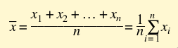
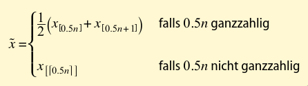
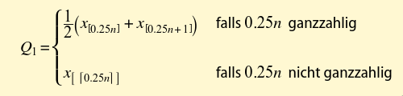
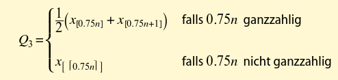
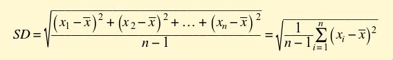
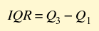
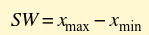
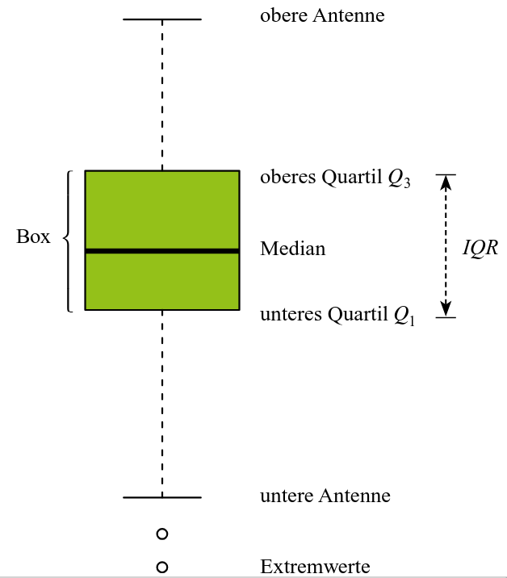

# Prüfung Datenanalyse

- Methoden der Datengewinnung
- Fehler bei der Datengewinnung
- Grundbegriffe der Datenanalyse
- grafische Darstellung (Diagrammtypen erstellen können, Vor-Nachteile)
- Kennzahlen kennen und berechnen können, auch ohne höhere Hilfsmittel und mit Hilfsmitteln (TI-Nspire)
- Sowohl das Histogram wie das Boxplot muss auch ohne Hilfsmittel erstellt werden können.
- Aussagen zu Diagrammtypen

# Methoden der Datengewinnung

- Experimente
- Befragungen
- Beobachtungsstudien
- Sekundärstatistische Erhebung

# Fehler bei der Datengewinnung

- zufällige Fehler
- systematische Fehler
- Übertragungsfehler
- mutwillige Fehler

# Grundbegriffe der Datenanalyse

# grafische Darstellung

# Kennzahlen

Man nehme bei den Definitionen hier eine sortierte Liste von ganzen Zahlen an.

## Mittelwert

## Median

> "... 50% der Ausprägungen kleiner oder gleich und 50% der Ausprägungen grösser oder gleich ... sind."

## Minimum

Das *Minimum* `x_min` eines Merkmals einer Stichprobe ist die kleinste auftretende Ausprägung.

## Maximum

Das *Maximum* `x_max` eines Merkmals einer Stichprobe ist die grösste auftretende Ausprägung.

## unteres Quartil

> "... 25% der Ausprägungen kleiner oder gleich und 75% der Ausprägungen grösser oder gleich ... sind."

## oberes Quartil

> "... 75% der Ausprägungen kleiner oder gleich und 25% der Ausprägungen grösser oder gleich ... sind."

## Standardabweichung (*standard deviation*)

## Interquartilsabstand

## Spannweite

# Histogram

- Anzahl `k` von Klassen definieren, idealerweise im Bereich `5 - 20`; oder `sqrt(n)`, wobei `n` die Anzahl Datensätze ist.
- Klassengrenzen definieren, sie sollten alle dieselbe Breite haben.
- Absolute Häufigkeiten definieren (= Anzahl Beobachtungen pro Klasse).
- Die Höhe eines Rechtecks wird auf einem Histogram proportional zur absoluten Häufigkeit der Klasse gezeichnet.
- Die Grafik wird zum Schluss noch mit dem Inhalt und Kontext entsprechen beschriftet und bezeichnet.

# Boxplot

Grundsätzlich wird im Boxplot folgendes Format befolgt:

- Minimum
- unteres Quartil
- Median
- oberes Quartil
- Maximum

Zwischen `unteres Quartil` und `oberes Quartil` wird eine Box eingefärbt. Hierin sind 50% aller Datensätze enthalten.
Oberhalb und unterhalb der Box werden Antennen eingezeichnet. Diese sind beim `Minimum`/`Maximum` wenn die Distanz zwischen
dessen Wert unterhalb 1.5 * `Interquartilsabstand` liegt. Wenn nicht, wird es da eingezeichnet und der Wert - sowie weitere
Werte ausserhalb dieser Grenze - als Extremwerte aufgeführt.

# Aussagen zu Diagrammtypen
