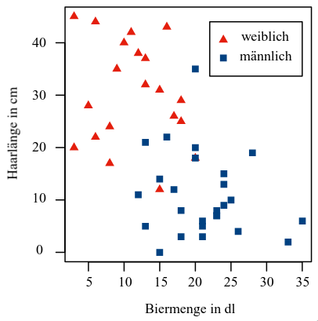

# Prüfung Datenanalyse

- Methoden der Datengewinnung
- Fehler bei der Datengewinnung
- Grundbegriffe der Datenanalyse
- grafische Darstellung (Diagrammtypen erstellen können, Vor-Nachteile)
- Kennzahlen kennen und berechnen können, auch ohne höhere Hilfsmittel und mit Hilfsmitteln (TI-Nspire)
- Sowohl das Histogram wie das Boxplot muss auch ohne Hilfsmittel erstellt werden können.
- Aussagen zu Diagrammtypen ????

# Methoden der Datengewinnung

- Experimente
- Befragungen
- Beobachtungsstudien
- Sekundärstatistische Erhebung

# Fehler bei der Datengewinnung

- zufällige Fehler
- systematische Fehler
- Übertragungsfehler
- mutwillige Fehler

# Grundbegriffe der Datenanalyse

## Grundgesamtheit

Die Menge der für eine Untersuchung relevanten Personen oder Objekte

## Stichprobe

Eine Teilmenge der Grundgesamtheit

zufällige Auswahl -> **Zufallsstichprobe** / **randomisierte Stichprobe**

## Stichprobenumfang

Die Anzahl der in der Stichprobe untersuchten Personen oder Objekte

Stichprobenumfang = Grundgesamtheit => **Vollerhebung**

## Bias

systematische Abweichung, welche bei einer nicht zufällig gezogenen Stichprobe
auftritt.

## Repräsentativität

Eine Stichprobe ist dann *repräsentativ*, wenn sie ein unverzerrtes Abbild
der Grundgesamtheit ist. d.h. für alle Merkmale entspricht die Verteilung
der Häufigkeiten in der Stichprobe jener in der Grundgesamtheit.

## Urliste

In der Urliste sind die ursprünglich erhaltenen Daten enthalten. Diese sind
hierbei noch nicht weiter bearbeitet worden.

## Datensatz

Die zusammengefassten Daten einer Studie, egal ob Urliste oder nicht.

## Untersuchungseinheiten

Bei jeder Datengewinnung werden Daten pro einzelne Untersuchungseinheiten gesammelt.
Jede Untersuchungseinheit erhält in einer Tabelle eine eindeutige ID, welche in der
ersten Spalte gespeichert wird.

## Merkmale / Variablen

An jeder Untersuchungseinheiten werden Daten für bestimmte Merkmale / Variablen erhoben.

```
   1 Variable     ->      univariat
   2 Variablen    ->      bivariat
(>2) Variablen    ->      multivariat
```

## Wert / Ausprägung

Der Wert, der eine Variable in einer Untersuchungseinheit annimmt wird als "Ausprägung" bezeichnet.

## Beobachtung

Eine Beobachtung ist eine Untersuchungseinheit sowie den Ausprägungen in dessen Merkmalen.

## Variablentypen


## geordnete Stichprobe und Rang

```
nominal       ->    gleiche Ausprägungen nacheinander
ordinal       ->    entsprechend der Ordnung der Merkmalsausprägungen
quantitativ   ->    in Reihenfolge der Grösse der Ausprägungen
```

Bei sortierten Datensätzen macht es auch Sinn, den Untersuchungseinheiten einen Rang zu geben.
Falls hierbei die gleichen Daten auf mehreren Rängen kommen, gibt es zwei Vorgehensweisen:

1. Ränge einfach so belassen
2. Den Rang der mehrfachigen Ausprägung mitteln.

Bsp: Die diskrete Ausprägung 5 erscheint auf den Rängen 3, 4, 5 in Liste x.

Bei ungerader Anzahl nimmt man den mittleren Rang und setze diesen zum Wert 5.

`x[1]`: 3  
`x[2]`: 4  
`x[4]`: 5  
`x[4]`: 5  
`x[4]`: 5  
`x[5]`: 7  
`x[6]`: 9  
...

Bei gerader Anzahl nimmt man den Wert in der Mitte, auch wenn man die ganzen Zahlen verlässt

`x[1]`:   2  
`x[2.5]`: 5  
`x[2.5]`: 5  
`x[4]`:   7  
...

# grafische Darstellung

## absolute / relative Häufigkeit


## Säulen- und Balkendiagramme

Hierbei werden qualitative Merkmale dargestellt. Die Höhe der Säulen /
die Breite der Balken werden durch die relative / absolute Häufigkeit der entsprechenden Ausprägung
bestimmt. Säulen / Balken werden mit Zwischenräumen voneinander getrennt.

## Kreisdiagramm

Im Kreisdiagramm werden die relativen Häufigkeiten einer einzelnen Ausprägung mit
Kreissektoren dargestellt. Der Zentriwinkel hiervon ist proportional zum prozentualen
Wert der relativen Häufigkeit.

## Streifenplot

Beim Streifenplot werden quantitative Merkmale dargestellt. Dient einem ersten
Überblick. Nicht unbedingt bei grossen Stichproben sinnvoll.


## Histogramm

> Prerequisite: Kennzahlen

Im Histogramm werden die Ausprägungen in **Klassen** eingeteilt. Schlussendlich
werden die Häufigkeiten innerhalb diesen Kategorien durch die Höhe der
Klassenrechtecke dargestellt. Keine Zwischenräume.

- Anzahl `k` von Klassen definieren, idealerweise im Bereich `5 - 20`;
  oder `sqrt(n)`, wobei `n` die Anzahl Datensätze ist.
- Klassengrenzen definieren, sie sollten alle dieselbe Breite haben.
- Absolute Häufigkeiten definieren (= Anzahl Beobachtungen pro Klasse).
- Die Höhe eines Rechtecks wird auf einem Histogramm proportional zur absoluten
  Häufigkeit der Klasse gezeichnet.
- Die Grafik wird zum Schluss noch mit dem Inhalt und Kontext entsprechen
  beschriftet und bezeichnet.


### Kategorisierung der Verteilung


## Boxplot

> Prerequisite: Kennzahlen

Grundsätzlich wird im Boxplot folgendes Format befolgt:

- Minimum
- unteres Quartil
- Median
- oberes Quartil
- Maximum


Zwischen `unteres Quartil` und `oberes Quartil` wird eine Box eingefärbt.
Hierin sind 50% aller Datensätze enthalten.
Oberhalb und unterhalb der Box werden Antennen eingezeichnet. Diese sind beim
`Minimum`/`Maximum` wenn die Distanz zwischen dessen Wert und dem entsprechenden
Quartil unterhalb 1.5 * `Interquartilsabstand` liegt. Wenn nicht, wird es da
eingezeichnet und der Wert - sowie weitere Werte ausserhalb dieser Grenze -
als Extremwerte aufgeführt.

## Streudiagramm

Im Streudiagramm werden zwei quantitative Merkmale dargestellt. Eine Ausprägung
entspricht der X-Koordinate, die andere der Y-Koordinate. An der definierten
Koordinate setze man ein beliebiges Zeichen.

Lineare Zusammenhänge, **Korrelationen** genannt, treten auf, wenn sich Punkte
um eine Gerade streuen. Man unterscheidet zwischen einer *positiven -* und einer
*negativen Korrelation*.


Aus einer Korrelation darf kein **kausaler Zusammenhang** geschlossen werden.
Wenn sich der Wert der einen Ausprägung verändert, muss sich nicht unbedingt
der Andere verändern. Beide könnten von einem **Störfaktor** beeinflusst worden
sein.



# Kennzahlen

Man nehme bei den Definitionen hier eine sortierte Liste von ganzen Zahlen an.

## Mittelwert


## Median

> "... 50% der Ausprägungen kleiner oder gleich und 50% der Ausprägungen grösser oder gleich ... sind."


## Modus

Der *Modus* ist die am häufigsten auftretende Ausprägung in einer Stichprobe.

## Minimum

Das *Minimum* `x_min` eines Merkmals einer Stichprobe ist die kleinste auftretende Ausprägung.

## Maximum

Das *Maximum* `x_max` eines Merkmals einer Stichprobe ist die grösste auftretende Ausprägung.

## unteres Quartil

> "... 25% der Ausprägungen kleiner oder gleich und 75% der Ausprägungen grösser oder gleich ... sind."


## oberes Quartil

> "... 75% der Ausprägungen kleiner oder gleich und 25% der Ausprägungen grösser oder gleich ... sind."


## Standardabweichung (*standard deviation*)


## Interquartilsabstand


## Spannweite


