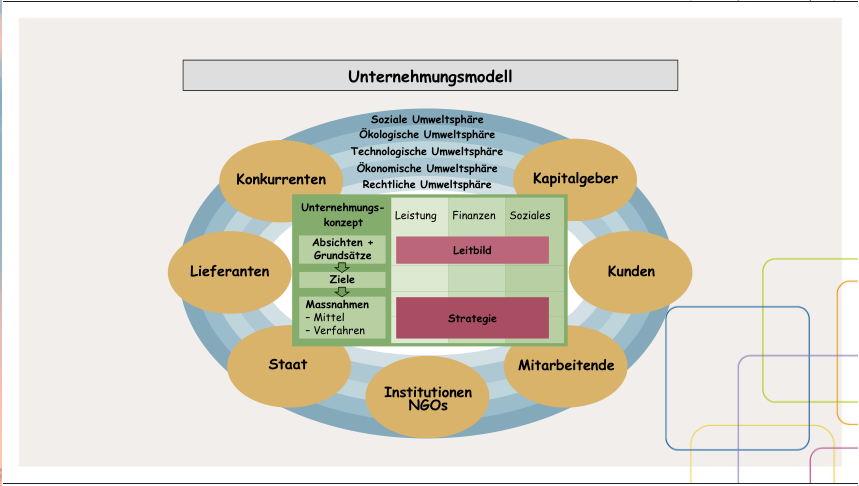
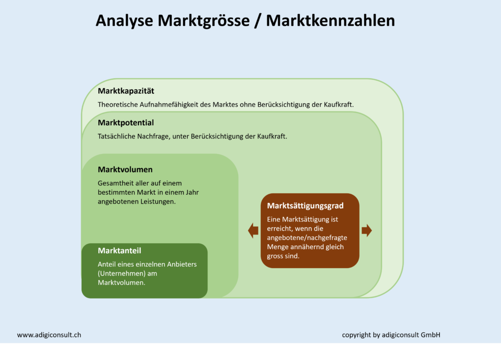
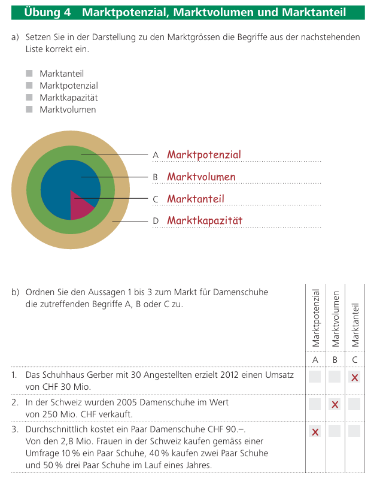
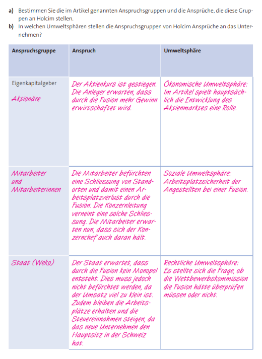
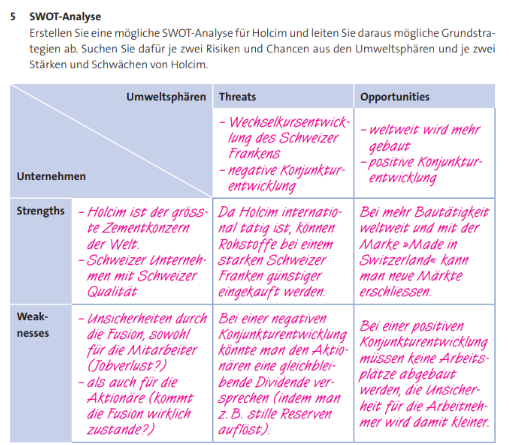

# WR Prüfung 24.10.2024



1. Leitbild beschreiben sowie nach Leistung, Finanzen, Sozialem unterscheiden können 
2. Anspruchsgruppen und Umweltsphären nennen und beschreiben können (Siehe Präsentation Unternehmensmodell) 
3. Zielkonflikte zwischen Anspruchsgruppen lösen können 
4. Branchenwettbewerbsanalyse für ein Unternehmen durchführen können (Five Forces) 
5. Marktgrössen bestimmen und berechnen können 
6. Schwächen und Stärken eines Unternehmens definieren können
7. SWOT-Analyse durchführen und Massnahmen (Strategien) ableiten

# 1. Leitbild

## 1.1. Beschrieb

> "die wichtigsten Absichten und Grundsätze zuhanden der Öffentlichkeit und der Mitarbeitenden"

- Wer sind wir?
- Verhaltensgrundsätze

Aussagen zu den Bereichen

- Leistung
- Finanzen
- Soziales

## 1.2. Unterscheidung

### Leistung

- Bedürfnisse
- Qualität und Preis

### Finanzen

- Rentabilität
- Gewinnverwendung

### Soziales

- Verhalten gegenüber Anspruchsgruppen
- Haltung gegenüber staatliche und gesellschaftliche Anliegen

# 2. Anspruchsgruppen und Umweltsphären

## Anspruchsgruppen

> "Personen oder Gruppierungen haben **direkte** Erwartungen und Ansprüche an die Unternehmung."

- Konkurrenten
- Kapitalgeber
- Kunden
- Mitarbeitende
- Institutionen, NGOs
- Staat
- Lieferanten

## Umweltsphären

> "Analyse des Umfeldes einer Unternehmung, eingeteilt in fünf unterschiedliche Bereiche.
   Einflüsse wirken **indirekt** auf die Unternehmung."

- soziale Umweltsphäre
- ökologische Umweltsphäre
- technologische Umweltsphäre
- ökonomische Umweltsphäre
- rechtliche Umweltsphäre

# 3. Zielkonflikte zwischen Anspruchsgruppen

## Beispiel

- Mitarbeitende wollen höhere Löhne.
- Kapitalgeber wollen Profit.

```
Löhne++ -> Produktionskosten++ -> Gewinn--
```

Man löse dies Beispielsweise durch Verringerung der Produktionskosten.

# 4. Five Forces

## 1. Rivalität unter den etablierten Wettbewerbern

- schwacher Wachstum -> mehr Unternehmen in der Branche, da neue Konkurrenten ihren eigenen Absatz
  im Markt ausschneiden können, ohne in die der Etablierten reinzuschneiden.
- unterschiedliche Produkte im Vergleich zur Konkurrenz -> Preisdruck--

## 2. Bedrohung durch neue Konkurrenten

- hohe Markteintrittsbarriere* -> weniger Konkurrenten
- Konkurrenten steigern den Preisdruck.

*Eine hohe Markteintrittsbarriere kann zum Beispiel ein Skaleneffekt sein, wo ein neu-eintretender
Konkurrent mit höheren Kosten als Etablierte rechnen muss. Bei einer höheren Produktdifferenzierung
wobei in der Branche eine hohe Bindung zum Produkt besteht, kann auch eine sein.

## 3. Verhandlungsstärke der Lieferanten

Hohe Umstellungskosten zwischen Lieferanten, wenn Unserer die Preise steigert.

## 4. Verhandlungsstärke der Kunden

- weniger Verhandlungsmacht der Kunden -> attraktivere Branche

## 5. Bedrohung durch Ersatzprodukte

Dies bezeichnet Produkte, welche denselben Zweck wie Unseres erfüllen können.

# 5. Marktgrössen

## Marktgrössen



## Marktgrössen - Bezeichnungen



# 6. Unternehmensstärken und -schwächen

Ist einfach Bestandteil der SWOT-Analyse?

# 7. SWOT-Analyse

## Ansprüche



## Strengths, Weaknesses, Opportunities, Threats


